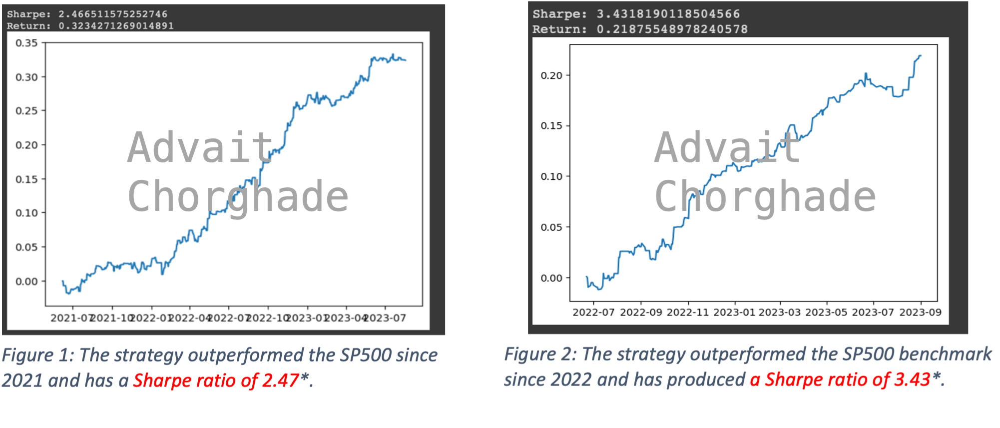
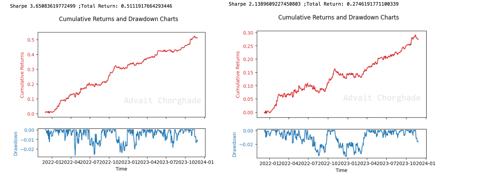

# AdvaitsAlgos
A set of profitable and outperforming systematic trading strategies currently used by the author.  

*Disclaimer: These strategies are potential source of alpha and are used in the authors current trading models. Therefore code will be limited to reduce exposure to intricate details yet still include novel and relevent details for the reader. *

The primary strategy used in the current market is shown below. The strategy is implimented on a basket of stocks ranging from a market cap of ~$1bln to $100bln. 

### Strategy 1:

The second strategy was discovered by myself on the 14th of April 2023. It 

\* assuming risk free rate of 0. 

There are several advantages and disadvantages to this strategy. 

Advantages: 

* Reduced risk of slippage (especially for larger cap names): The algorithm primarily uses limit orders. The algorithm takes the assumption that all shares will be filled which is not realistic with large shares. Research needs to be done to backtest the maximum amound of shares that are available during execution time. Getting historical minute candles is expensive (especially older than 1 month) which has let me to increase the order price threshold by 1 cent. Fortunately in the backtest this has had a slight impact on returns and sharpe and is still profitable.
* As no positions is held overnight, the risk is considerably reduced. Many brokers allow up to 4x leverage on day trading, implying the strategy can be leveraged. 

Disadvantages:

* As briefly described in the advantages - the order may not be filled at a specific price. More research needed.
* Sharpe has been calculated with 0% interest rates - clearly not realistic. Difficulty: Interest rates have been volitile - TODO: How to calculate Sharpe with varying interest rates.

### Strategy 2:

The second strategy was discovered by myself on the 23rd of October 2023.

[LHS: Perfect entry ; RHS: Adjusted slippage on $250k]

Sharpe based on 0% risk free rate. 

Advantages: 

* As no positions is held overnight, the risk is considerably reduced. Many brokers allow up to 4x leverage on day trading, implying the strategy can be leveraged.

Disadvantages:

* Subject to slippage - especially in lower volume traded names.
* Linked to above - available liquidity. The model requires accumilating large positions in a small amount of time, causing changes in the average price reducing returns.
* Can be subject to tail risk more than strategy 1. Constant monitering will be required. 

  
